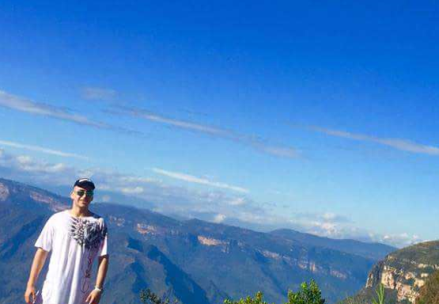

### Quien Soy 
Me llamo Mateo Restrepo Higuita, naci en medellin el 7 de abril de 1999, me considero una persona divertida, me gustan mucho los retos y me gusta viajar mucho  y tener nuevas experiencias, soy una persona que se exfuerza por superarce dia a dia para ser mejor en lo que haga sea lo que sea. 

Me gusta practicar varios deportes como rugby, natacion y montar bicicleta y estar rodea de naturaleza. 

###Que Estudio 
En el momento estoy en el pregrado de Estadistica de la Universidad Nacional De Colombia, esta carrera me gusta y me apasiona mucho, Tambien estoy estudiando Ingles y Aleman para ampliar mis conocimientos ya que en lo que me quiero desallorar en un futuro necesito saber varios idiomas 

### En El Futuro
Aspiro en 3 años irme a hacer un post grado en Canada o en Alemania en todo lo relacionado con cienca de datos y de computacion ya que este tema junto con la economia me apasionan, me llaman la atencion  y me gustaria mucho tener muchos conocientos sobre todos estos temas y conocer muchos lugares del mundo 

